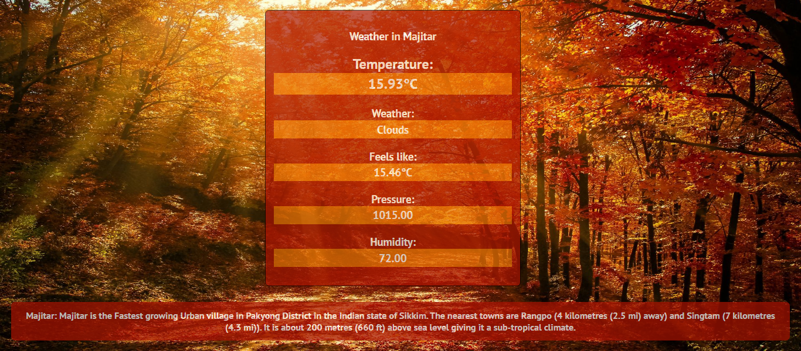

# Weather Forecast

## Table of contents

- [General info](#general-info)
- [Technologies](#technologies)
- [Setup](#setup)
- [Screenshots](#screenshots)

## General info

- A webapp which uses OpenWeatherMap to request API calls for weather based on the PIN Code of an area entered by the user.
- It also uses wikipedia module in Python to give a short information about the place as found from the API request.


## Technologies

Project is created with:

- Python3 (v==3.8.10)
- Flask (v==2.1.2)
- HTML and CSS

## Setup

- Install the dependencies

```
$ pip install Flask
$ pip install wikipedia
```

- To run this project, clone it locally using git:

```
$ git clone https://github.com/bistimulus/Weather-Forecast.git
$ cd Weather-Forecast
$ python3 Main.py

```

## Screenshots

### Pin Code: 737136



### Pin Code: 110001


### Pin Code: 737135


